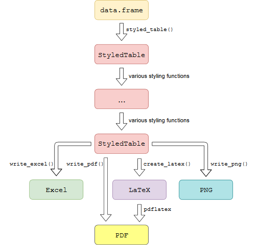

# styledTables 

<!-- badges: start -->
[](https://travis-ci.org/R-package/styledTables)
[](https://github.com/R-package/styledTables/commits/master)
[](https://github.com/R-package/styledTables)


`styledTables` is an **R** package that makes it possible to export a
`data.frame` as beautifully styled **Excel** and **LaTeX** table.

> Produce tables, which you want to look at.

Have a look at the [get started vignette] to see `styledTables` in action.

## Installation

```{r, eval = FALSE}
# Install development version from GitHub
devtools::install_github('R-package/styledTables', build_vignettes = TRUE)
```

## Concept

Transform a `data.frame` into a `StyledTable` class object. 
Use various styling functions to fine-tune the appearance of your table.
When you are finished, you can export your `StyledTable` to:

* `PDF`: Save a `PDF`-Image of your table
* `PNG`: Save a `PNG`-Image of your table
* `LaTeX`: Get the `LaTeX`-Code of your styled table, in order to include
  the code inside of an `Rnw`-File.
* `Excel`: Create a styled Excel-Worksheet inside an [xlsx]-workbook.

<p>

</p>

## Further reading

More information can be found on the [github-pages site] for `styledTables` 

* A simple guide is given in the [getting started vignette].
* A vast list of available styling functions is the [styling functions vignette].
* The creation of `Excel` tables is described in the [excel export vignette]
* The creation of `LaTeX` inside of `Rnw` files is described in the [LaTeX inside Rnw vignette]
* The easy creation of cross tables is described in the [cross table vignette].

## License

[GPL-3]
  
[get started vignette]:  https://R-package.github.io/styledTables/articles/styledTables.html
[styling functions vignette]:  https://R-package.github.io/styledTables/articles/styling_functions.html
[excel export vignette]: https://R-package.github.io/styledTables/articles/excel_export.html
[LaTeX inside Rnw vignette]: https://R-package.github.io/styledTables/articles/latex_inside_rnw.html
[cross table creation vignette]: https://R-package.github.io/styledTables/articles/cross_table_creation.html
[github-pages site]: https://R-package.github.io/styledTables
[xlsx package]: https://cran.r-project.org/web/packages/xlsx/xlsx.pdf
[GPL-3]: https://R-package.github.io/styledTables/LICENSE
```

