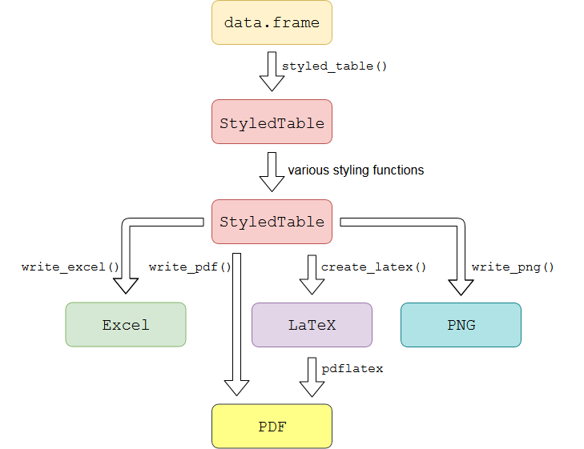

# styledTables 

<!-- badges: start -->

[](https://travis-ci.org/R-package/styledTables)
[](https://github.com/R-package/styledTables/commits/master)
[](https://github.com/R-package/styledTables)

`styledTables` is an **R** package that makes it possible to export a
`data.frame` as beautifully styled **Excel** and **LaTeX** table.

> Produce tables, which you want to look at.

Have a look at the [get started
vignette](https://R-package.github.io/styledTables/articles/styledTables.html)
to see `styledTables` in action.

## Installation

``` r
# Install development version from GitHub
devtools::install_github('R-package/styledTables', build_vignettes = TRUE)
```

styledTables needs certain LaTeX packages in order to support export to `tex`,
`png` and `pdf`. To install those dependencies on ubuntu, the following terminal
commands can be used:

```bash
apt install texlive-latex-extra
tlmgr install standalone
```


## Concept

Transform a `data.frame` into a `StyledTable` class object. Use various
styling functions to fine-tune the appearance of your table. When you
are finished, you can export your `StyledTable` to:

  - `PDF`: Save a `PDF`-Image of your table
  - `PNG`: Save a `PNG`-Image of your table
  - `LaTeX`: Get the `LaTeX`-Code of your styled table, in order to
    include the code inside of an `Rnw`-File.
  - `Excel`: Create a styled Excel-Worksheet inside an
    \[xlsx\]-workbook.

<p>



</p>

## Further reading

More information can be found on the [github-pages
site](https://R-package.github.io/styledTables) for `styledTables`

  - A simple guide is given in the [get started
    vignette](https://R-package.github.io/styledTables/articles/styledTables.html).
  - A vast list of available styling functions will soon be available
    through the [styling functions
    vignette](https://R-package.github.io/styledTables/articles/styling_functions.html).
  - The creation of `Excel` tables is described in the [get started
    vignette](https://R-package.github.io/styledTables/articles/styledTables.html)
  - The creation of `LaTeX` inside of `Rnw` files is described in the
    [get started
    vignette](https://R-package.github.io/styledTables/articles/styledTables.html)
  - The easy creation of cross tables is described in the [cross table
    vignette](https://R-package.github.io/styledTables/articles/cross_table_creation.html).

## License

[GPL-3](https://R-package.github.io/styledTables/LICENSE)
