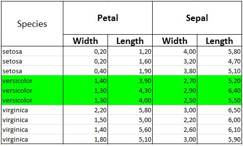
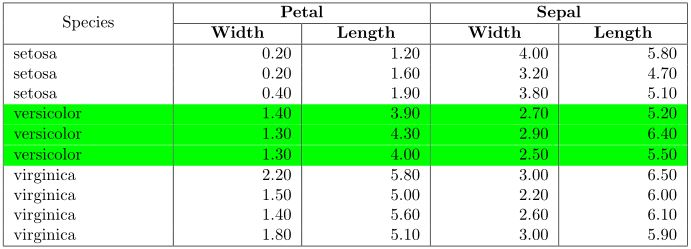
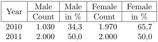
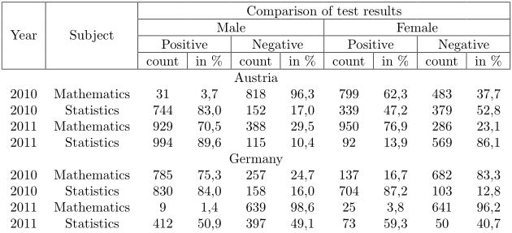

styledTables
============

The creation of styled *Excel* or *LaTeX* tables in *R* has never been
easier.

Installation
------------

        devtools::install_github('R-package/styledTables', build_vignettes = TRUE)

Usage
-----

### Loading the R package

        library(styledTables)
        library(dplyr)
        library(xlsx)

### Generate a styled table from a data.frame

        df1 <- data.frame(...)
        sTbl1 <- styledTable(df1)

### Vertically concatenating multiple data frames or styled tables in a single styled table

        df2 <- data.frame(...)
        df3 <- data.frame(...)
        sTbl <- styledTable(sTbl1, df2, df3)

### Styling the cells of a styled table

        sTbl <- sTbl %>%
          setBorderPosition(c("left", "right", "bottom", "top"), rows = 1:10, cols = 1:2) %>%
          setBold(TRUE, rows = 1:10, cols = 1:2) %>%
          ... # see all possible styling methods under "Styling methods"

### Write styled table to Excel sheet

        wb <- createWorkbook()
        sheet <- createSheet(wb, "iris_table")
        sheet %>%
          writeToExcelSheet(sTbl, firstRow = 1, firstCol = 1)
        saveWorkbook(wb, "test.xlsx")

### Generate LaTeX table code (inside of a chunk of an Rnw-file)

Put the following code in the LaTeX preambel (at the top of an `Rnw`
file):

        usepackage{multirow}
        usepackage{hhline}
        usepackage{ragged2e}
        usepackage[table]{xcolor}
        usepackage{pbox}

Put the following code at the end of the chunk where the table should be
generated:

        sTbl %>%
          createLatexTable %>%
          cat

Example
-------

### Excel table generation

In order to generate an Excel table execute the following command

    source("test1.R")

Where the file `test1.R` looks as follows

    library(xlsx)
    library(dplyr)
    library(styledTables)

    # ---- prepare the data ----
    bodyData <- iris[(1:10)*15,] %>%                        
        select(Species, Petal.Width, Petal.Length, Sepal.Width, Sepal.Length) %>%
        arrange(Species)

    # ---- Put the header and the body together ----
    sTbl <- styledTable(
            data.frame(
                "Species",
                c("Petal", "Width"),
                c("Petal", "Length"),
                c("Sepal", "Width"),
                c("Sepal", "Length")
            ),
            bodyData
        ) %>%
        # ---- style the header ----
        # set merged cells
        addMerge(rows = 1:2, cols = 1) %>%
        addMerge(rows = 1, cols = 2:3) %>%
        addMerge(rows = 1, cols = 4:5) %>%
        # set font size
        setExcelFontSize(15) %>%
        # set column widths
        setExcelColWidths(18, cols = 1) %>%
        setExcelColWidths(13, cols = 2:5) %>%
        # set row heights
        setExcelRowHeights(51, rows = 1) %>%
        setExcelRowHeights(18, rows = 2) %>%
        # set borders
        setBorderPosition(c("top", "bottom", "left", "right"), rows = 1:2) %>%
        # set alignment
        setHorizontal("center", rows = 1:2) %>%
        setExcelVertical("center") %>%
        # set bold text
        setBold(TRUE, cols = 2:5) %>%
        # ---- style the body ----
        # set borders
        setBorderPosition(c("left", "right"), rows = 3:12) %>%
        setBorderPosition("bottom", rows = 12) %>%
        # set alignment
        setHorizontal("left", rows = 3:12, cols = 1) %>%
        setHorizontal("right", rows = 3:12, cols = 2:5) %>%
        # color all rows where Species == "versicolor"
        setFillColor("#00FF00", rows = 3:12, condition = X1 == "versicolor") %>%
        setExcelDataFormat("#0.00", rows = 3:12, cols = 2:5)

    # ---- create Excel sheet with xlsx package ----
    wb <- createWorkbook()
    sheet <- createSheet(wb, "iris_table")

    # ---- write styled table to the Excel sheet ----
    sheet %>%
        writeToExcelSheet(sTbl, firstRow = 2, firstCol = 2)

    # ---- save the workbook ----
    saveWorkbook(wb, "test.xlsx")

#### This code generates the following Excel sheet:

### LaTeX table generation

In order to generate a LaTeX table execute the following command

        knitr::knit("test2.Rnw")

Where the file `test2.Rnw` looks as follows

    \documentclass[a4paper]{article}
    \usepackage{ragged2e}
    \usepackage{multirow}
    \usepackage{pbox}
    \usepackage{hhline}
    \usepackage[table]{xcolor}

    \begin{document}

    <<results='hide', echo = FALSE, message = FALSE>>=
    # ---- SAME CODE AS FOR EXCEL TABLE GENERATION ----
    library(...
    bodyData <- ...
    sTbl <- ...

    # ---- ADAPTATION FOR LATEX TABLES
    # The "dataFormat" setting is not working in LaTeX,
    # therefore we use the setting "latexPreProcess" where we can define 
    # a function that pre processes the values before using them inside the 
    # LaTeX table
    sTbl %>%
        # round all numers before using them inside the LaTeX table
        setLatexPreProcess(function(x) sprintf("%0.2f", x), rows = 3:12, cols = 2:5)
    @

    <<results='asis',echo=FALSE, message=FALSE>>=
    # ---- generate the LaTeX table ----
    sTbl %>%
        createLatexTable %>%
        cat
    @
    \end{document}

#### Resulting pdf table:

Styling methods
---------------

-   `addMerge`: Merge cells
    -   Excel: Working
    -   LaTeX: Working
-   `mergeEqualCells`: Merge all cells that have the same value
    -   Excel: Working
    -   LaTeX: Working
-   `setExcelRowHeights`: Set row heights for Excel tables
    -   Excel: Working
    -   LaTeX: Use `setLatexRowHeights` instead
-   `setLatexRowHeights`: Set row heights for LaTeX tables
    -   Excel: Use `setExcelRowHeights` instead
    -   LaTeX: Not working
-   `setExcelColWidths`: Set col widths for Excel tables
    -   Excel: Working
    -   LaTeX: Use `setLatexColWidths` instead
-   `setLatexColWidths`: Set col widths for LaTeX tables
    -   Excel: Use `setExcelColWidths` instead
    -   LaTeX: Not working
-   `setExcelFontName`: Set font that should be used for Excel tables
    -   Excel: Working
    -   LaTeX: Not working (TODO)
-   `setExcelFontSize`: Set the font size for Excel tables
    -   Excel: Working
    -   LaTeX: Use `setLatexFontSize` instead.
-   `setLatexFontSize`: Set font size for LaTeX tables
    -   Excel: Use `setFontHeight` instead
    -   LaTeX: Working
-   `setFontColor`: Set the font color
    -   Excel: Working
    -   LaTeX: Working
-   `setBold`: Set cell content bold
    -   Excel: Working
    -   LaTeX: Working
-   `setItalic`: Set cell content italic
    -   Excel: Working
    -   LaTeX: Working
-   `setStrikeout`: Set cell content striked through
    -   Excel: Working
    -   LaTeX: Not working (TODO)
-   `setExcelBoldweight`: Set the weight of the bold style
    -   Excel: Working
    -   LaTeX: Not working
-   `setWrapped`: Make the cell a wrapped cell
    -   Excel: Working
    -   LaTeX: Not Working: Alwayes wrapped
-   `setHorizontal`: Set the horizontal alignment of the cell content
    -   Excel: Working
    -   LaTeX: Working
-   `setExcelVertical`: Set the vertical alignment of the cell content
    for Excel tables
    -   Excel: Working
    -   LaTeX: Use `setLatexVerticalMove` instead.
-   `setLatexVerticalMove`: Set the offset (e.g.: "+1em") of the cell
    content for LaTeX tables
    -   Excel: Use `setExcelVertical` instead
    -   LaTeX: Working
-   `setExcelDataFormat`: Set the Excel cell data format that should be
    used (e.g.:"\#,\#\#0.00")
    -   Excel: Working
    -   LaTeX: Use `setPreProcess` instead
-   `setExcelPreProcess`: Define a function that should be used to pre
    process the cell value in Excel tables (useful for replacing numbers
    or strings)
    -   Excel: Working
    -   Latex: Use `setLatexPreProcess` instead
-   `setLatexPreProcess`: Define a function that should be used to pre
    process the cell value in LaTeX tables (useful for rounding etc.)
    -   Excel: Use `setExcelDataFormat` or `setExcelPreProcess` instead
    -   LaTeX: Working
-   `setRotation`: Set the rotation of the cell content
    -   Excel: Working
    -   LaTeX: Not working (TODO)
-   `setIndent`: Set the indentation of the cell content
    -   Excel: Working
    -   LaTeX: Working
-   `setBorderPosition`: Define on which edges of the cell the border
    should be drawn
    -   Excel: Working
    -   LaTeX: Working
-   `setBorderColor`: Set the border color of the cell
    -   Excel: Working
    -   LaTeX: Not working: Always black (TODO)
-   `setBorderPen`: Set the border type that should be used
    -   Excel: Working
    -   LaTeX: Not working: Always solid (TODO)
-   `setFillColor`: Set a fill color for the cell
    -   Excel: Working
    -   LaTeX: Working
-   `setFillPattern`: Set a fill pattern that should be used for the
    cell
    -   Excel: Working
    -   LaTeX: Not working: Always solid (TODO)
-   `setExcelLocked`: Make an Excel cell a locked cell
    -   Excel: Working
    -   LaTeX: Not necessary
-   `setExcelHidden`: Make an Excel cell a hidden cell
    -   Excel: Working
    -   LaTeX: Not working

Additional functionalities
--------------------------

### Predefined formatting function

If you do not want to loose time, defining all the table styles
yourselve, you can also use the predefined formatting methods that
`styledTables` comes along with:

-   `formatStatHeader`: This function is usually applied to styled
    tables that only contain the header rows of your styled tables. It
    gives you the same formatting that is used in the header rows of the
    tables published by the *Austrian institute of statistics*
-   `formatStatBody`: This function is usually applied to styled tables
    that only contain the data rows of your styled tables. It gives you
    the same formatting that is used in the table body rows of the
    tables published by the *Austrian institute of statistics*
-   `formatStatAbsolute`: This function changes the output format of
    your number columns such that they are displayed as rounded numbers
    with a thousand separator. This number format is also used for the
    counting columns in the tables published by the *Austrian institute
    of statistics*
-   `formatStatRelative`: This function changes the output format of
    your number columns such that they are displayed as rounded numbers
    with one digit after the decimal mark. This number format is also
    used for the percentage columns in the tables published by the
    *Austrian institute of statistics*

In order to generate the following LaTeX table execute the following
command

        knitr::knit("test3.Rnw")

Where the file `test3.Rnw` looks as follows

    \documentclass[a4paper]{article}
    \usepackage{ragged2e}
    \usepackage{multirow}
    \usepackage{pbox}
    \usepackage{hhline}
    \usepackage[table]{xcolor}

    \begin{document}

    <<results='hide', echo = FALSE, message = FALSE>>=
    # create styled header
    sHeader <- data.frame(
            c("Year", "Year"),
            c("Male", "Count"),
            c("Male", "in %"),
            c("Female", "Count"),
            c("Female", "in %")
        ) %>%
        styledTable %>%
        addMerge(rows = 1:2, cols = 1) %>%
        formatStatHeader
    # create styled body
    sBody <- data.frame(
            year = c("2010", "2011"),
            maleN = c(1030, 2000),
            maleRel = c(34.33333, 50),
            femaleN = c(1970, 2000),
            femaleRel = c(65.66666, 50)
        ) %>%
        styledTable %>%
        formatStatBody %>%
        formatStatAbsolute(cols = c(2, 4)) %>%
        formatStatRelative(cols = c(3, 5))
    # concatenate sHeader and sBody
    sTbl <- styledTable(sHeader, sBody)
    # create the LaTeX table ----
    sTbl %>%
        createLatexTable %>%
        cat
    @
    \end{document}

#### Resulting pdf table:

### Fast creation of cross tables

Creating nicely styled *cross tables* in R can be tedios, even when you
use `styledTables`. Therefore, we implemented the following functions,
which make it very easy and offer a huge range of possibilities:

-   `createStyledCrossTableHeader`: As the name tells, this function can
    be used to create a styled table that holds the header rows of your
    cross table. It has the following features:
    -   Define several *Y* columns, which hold the values that are used
        to group the cross table data row wise.
    -   Specify several *X* columns that hold the values that are used
        to group the cross table data column wise. If you use more than
        one *X* column the resulting *X* column header has a hirachy
        structure and has more then one row: For each given *X* column
        name one extra hirachy level and therefore one extra header row.
-   `createStyledCrossTableBody`: This function takes a data.frame and
    creates a styled cross table body from it. This styled body can be
    concatenated to the styled header created by
    `createStyledCrossTableHeader` into a full cross table. The body
    creation has the folloging features:
    -   Optionally define one ore more *subTable* columns, which are
        used to group the data into several sub tables. Each sub table
        has a heading row above the sub table body. As sub table
        headings text the corresponding values in *subTable* column
        are used. If more than one *subTable* column is defined the sub
        tables headings will have a nested hirachy, where the first
        *subTable* has the highest hirachy level.
    -   Define several *Y*, which will be used to group the cross table
        data row wise. The defined *Y* columns will be placed on the
        left side of the cross table.
    -   Specify one ore more *X* columns, which will be used to group
        the cross table data column wise. If more than one *X* column is
        given, then a hirachy level will be introduced, where the first
        given *X* column has the highest hirachy level.
    -   Define one ore more *value* columns. The value column defines
        the actual values that should be shown in the cross table body.
        If more than one *value* column is defined, then more then one
        type of value should be visible for each cross table
        x/y grouping. This is achieved by adding extra columns to *X*
        column grouping. It has a similar effect like adding an extra
        hirachy level to the cross table header.

In order to generate the following LaTeX table execute the following
command

        knitr::knit("test4.Rnw")

Where the file `test4.Rnw` looks as follows

    \documentclass[a4paper]{article}
    \usepackage{ragged2e}
    \usepackage{multirow}
    \usepackage{pbox}
    \usepackage{hhline}
    \usepackage[table]{xcolor}

    \begin{document}

    <<results='hide', echo = FALSE, message = FALSE>>=
    # prepare data set for cross table
    studentsData <- data.frame(
            country = rep(c("Germany", "Austria"), each = 16),
            year = c(rep("2010", 8), rep("2011", 8)),
            subject = rep(c(rep("Mathematics", 4), rep("Statistics", 4)), 2),
            gender = rep(c(rep("Male", 2), rep("Female", 2)), 4),
            result = rep(c("positive", "negative"), 16),
            N = sample(1:1000, 32)
        ) %>%
            group_by(country, year, subject, gender) %>%
            mutate(rel = 100 * N / sum(N)) %>%
            ungroup
    # setup styled header
    sHeader <- createStyledCrossTableHeader(
            yColHeadings = c("Year", "Subject"),
            crossTableHeading = "Comparison of test results",
            c("Male", "Female"),
            c("Positive", "Negative"),
            c("count", "in %")
        ) %>%
        formatStatHeader
    # setup styled cross table body
    sBody <- createStyledCrossTableBody(
            data = studentsData,
            subTableCols = "country",
            subHeadingStyling = function(object) 
                addMerge(object, rows = 1, cols = 1:nCols(object)) %>%
                setHorizontal("center"),
            bodyStyling = function(object) setHorizontal(object, "center"),
            yCols = c("year", "subject"),
            xCols = c("gender", "result"),
            valueCols = c("N", "rel"),
            valueColStylings = list(
                formatStatAbsolute,
                formatStatRelative
            ),
            fillValues = list(0, 0)
        )
    # concatenate styled header and styled body into a single styled table
    sTbl <- styledTable(
            sHeader,
            sBody
        )
    # create the LaTeX table ----
    sTbl %>%
        createLatexTable %>%
        cat
    @
    \end{document}

#### Resulting pdf table:

License
-------

GPL-3
