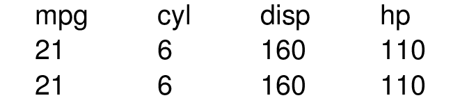

```{r setup, include = FALSE}
knitr::opts_chunk$set(
  collapse = TRUE,
  comment = "#>"
)
```

This vignette will showcase how styledtables can be used with LaTeX documents
of various kinds (`.tex`, `.Rmd` and `Rnw`). For all subsequent examples, we
will use a subset of the mtcars dataset.

```{r}
library(styledTables)
mytable <- styled_table(mtcars[1:2, 1:4], keep_header = TRUE)
```

## Installation

In order to compile the exported LaTeX code, it is necessary to have certain
CTAN packages installed. In some cases, the tables are even compiled implicitly
via `write_png()`.

One way is to install a standalone compiler via the tinytex package.

```{r, eval = FALSE}
install.packages("tinytex")
tinytex::install_tinytex()
```

This has several advantages

* Tinytex downloads CTAN packages as needed during compilation, so tex
  dependencies are managed under the hood
* The installation is in the user's home folder. Therefore, no administative
  privileges are required to run `install_tinytex()` and also to use the
  binaries downloaded by this function.
* The installation only requires two lines of code and works on any platform

Another option is to install the system dependencies directly. In case of
ubuntu, the following setup is used on our travis CI machine.

```bash
apt install texlive-latex-extra
tlmgr install standalone
```

To verify a correct installation of all tex dependencies, the function
`write_pdf()` can be used.

```r
write_pdf(mytable, "mytable.pdf")
```

A list of all required tex-packages can be displayed with `st_preamble()`.

## tex export

To generate latex code from a table, use the function `create_latex_table()`
and insert the resulting code into your tex document.

```{r}
tex_code <- create_latex_table(mytable)
cat(tex_code)
writeLines(tex_code, "table.tex")
```

You will need to make sure that the preamble of the document loads the following
packages. Otherwise, it won't be possible to compile the table-code.

```{r}
cat(st_preamble())
```

## pdf and png export

The function `write_png(mytable, file = "mytable.pdf")` automatizes the above steps

1. It writes a standalone tex file based on `st_preamble()` and
   `create_latex_table(mytable)`
2. It renders the tex file into a pdf using `pdflatex`
3. It performs all cleanup operations such that only the pdf file remains

A very similar function is `write_png` which converts the pdf document into a
png image file, which is easier to use on websites.

## Rmd export

In order to use a styledTable inside a Rmd document, the object can just be
printed inside a chunk. 

```{r,comment="", echo=FALSE}
cat("```{r, out.width = '50%', fig.align='center'}", sep = "\n",
    "mytable", "```")
```

```{r, out.width = "50%", fig.align='center', echo = FALSE}
mytable
```

In case of html-based output formats (`html_document`, `ioslides_presentation`,
...), the table is exported to an image file with `write_png` and the resulting
image is included in the document. As shown in the example above, the chunk
options `out.width` and `fig.align` can be used to modify the position and
scale of the table.

In case of latex-based output formats (`pdf_document`, `beamer_presentation`,
...), the LaTeX code produced by `create_latex_table()` is inserted in place and
the necessary tex-dependencies are automatically included in the preamble via
some `knitr` magic.

Currently, there is no support for output formats like `word_document`
and `powerpoint_presentation` which are neither based on html not LaTeX. For
that usecase, it is recommended to convert the table into an image file using
`write_png()` and include the image manually.

```{r, out.width = "50%", fig.align = 'center'}
write_png(mytable, "mytable.png")

```

In this case, the chunk options `out.width` and `fig.align` can be used in the
same way as for html-based output formats.

## Rnw export

Currently it is possible to print tables inside Rnw documents to get the same
results as in Rmd documents that use a LaTeX-based output (`pdf_document`,
`beamer_presentation`, ...). However, the automatic injection in the preamble
only works if `knitr` is used as the render engine. For Sweave documents, the
output of `st_preamble()` needs to be copied into the preamble as described in
the "tex export" section.
